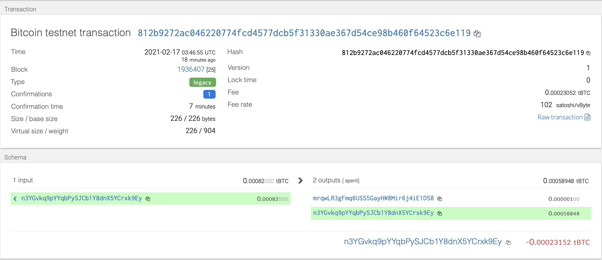
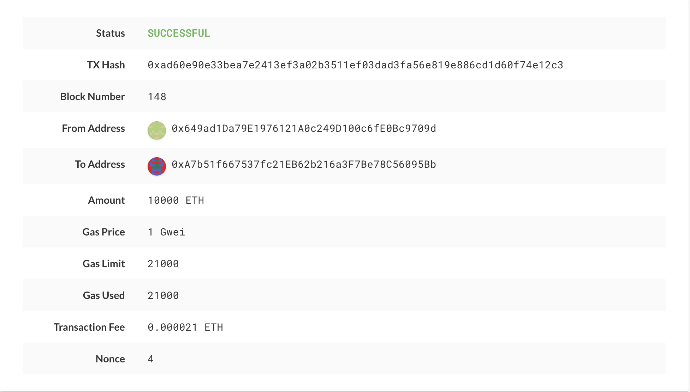

# MultiCoin Crypto Wallet

## Description
This wallet uses the BIP44 standard to derive addresses for different coins using a single mnemonic phrase.  The addresses in this demo were generated utilizing the Hd-Wallet-derive tool. The mnemonic was randomly generated using the BIP39 tool.  The python files contain functions to generate the addresses by running the hd-wallet-tool through the terminal,retrieving addresses in json format, then converting them into a dictionary format; Another function that creates an account object of the private key for each different coin. A third function that creates a transaction for each coin. And a fourth function for sending the transaction. To use the wallet simply create a variable that pulls the private key for a particular coin's derived address you would like to use.  Each address is indexed so its easy to go through all the addresses. Then, use the variable as part of the send_tx function to make transactions. 
#### BTC-testnet
`btctest_account =  priv_key_to_account(BTCTEST, coins[BTCTEST][0]['privkey'])` 
`send_tx(BTCTEST,btctest_account,'mrqwLR3gFmq6USS5GayHW8Mir6j4iE1D58', 0.000001)`

#### Ethereum
`eth_account = priv_key_to_account(ETH, coins[ETH][0]['privkey'])` 
`send_tx(ETH, eth_account, '0xA7b51f667537fc21EB62b216a3F7Be78C56095Bb', 10000)`

